# **Signals and Slots**

### Learn how to make connexions between objects.


[Introduction](#Introduction)<br>
[Signals and slots](#Signals-and-slots)<br>
[Calculator](#Calculator) <br>
[Traffic Light](#Traffic-Light) <br>
[Digital Clock](#Digital-Clock)<br>
[Conclusion](#Conclusion)<br>
<br>


## Intoduction


<p>"When the user clicks on this button , run this code" is probably one of the oldest problems in programming; many solutions have been proposed through the years. Qt has its own solution : the signals and slots mechanism.
<br> When the button gets clicked,it emits a signal telling everyone (who's listening) that it has been clicked by the user. The slot implements the code we want to run . And the final magic:a connection gets established between the signal and the slot.</p>
<br>

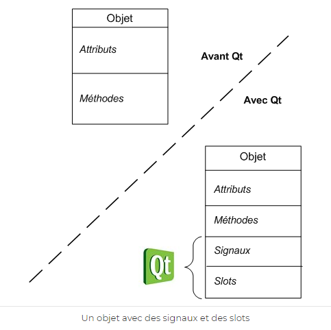
<br>

## Signals and Slots


The idea of **signals-slots** is to create a particular “link” between two functions of two independent classes, so that when we call the function of the first object, the function of the second object is automatically called. The first function is called **“signal”**, the second **“slot”**, the link between the two is called a **“connection”**.
<br>

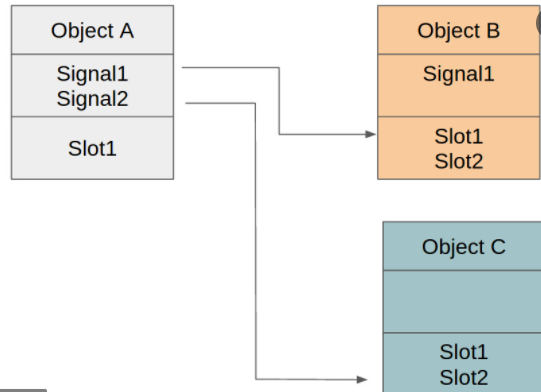
<br>


## Calculator


<p>This exercise follows up to add interactive functionality to the calculator widgets written in the previous homework. Our main goal is to use Signals and Slots to simulate a basic calculator behavior. The supported operations are *, +, -, /.
</p>

SO we will create a class called **calculator**  who implements this four main functions :
<p>

*  **createWidgets():** Function to create the widgets.
 * **placeWidget() :** Function to place the widgets.
  * **makeConnexions() :** to make connexions.
  * **keyPressEvent(QKeyEvent *e)**<br>

with this four customer slots:

* **newDigit() :** to get which button was clicked.
* **changeOperation() :** to handle the click on operations. 
* **myOperations() :** to implement operations.
* **clear() :** to clear the screen and reintialize the number by 0.

and that inherits from this classes :
* **QPushButton:** to create the button -enter- .
* **QLCDNumber:** Constructs an LCD number, sets the number of digits to numDigits.
* **QVector :** to store a pointer to each digit and operation button.
* **QMainWindow:** provides a framework for building an application's user interface.
* **QGridLayout :** to do an horizontal and vertical layout a once.
* **QKeyEvent:** describes a keyboard event.
* **math.h:**  defines various mathematical functions .
</p>

<br>

-----------
## Calculator.h 


<br>


<p>here we declare our methods,constructor,destuctor and widgets :</p>


```JavaScript
#include <QMainWindow>
#include <QGridLayout>
#include <QVector>
#include <QPushButton>
#include <QLCDNumber>

class Calculator : public QWidget
{
    Q_OBJECT
public:
    Calculator(QWidget *parent = nullptr);
    ~Calculator();

public slots:
   void newDigit();
   void changeOperation();
   void myOperations();
   
   // Add you custom slots here
   void clear();
   void addOperations();

protected:
    void createWidgets();        //Function to create the widgets
    void placeWidget();         // Function to place the widgets
    void makeConnexions();// Create all the connectivity

//events
protected:
    void keyPressEvent(QKeyEvent *e)override;     //Override the keypress events
    void newdig(QKeyEvent *e);
    void newoperator(QKeyEvent *e);

private:

    QGridLayout *buttonsLayout; // layout for the buttons
    QVBoxLayout *layout;        //main layout for the button
    QVector<QPushButton*> digits;  //Vector for the digits
    QPushButton *enter;            // enter button
    QPushButton *DEL;
    QString *trig=nullptr;
    QVector<QPushButton*> operations; //operation buttons
    QVector<QPushButton*> othorOperations;
    QLCDNumber *disp;             // Where to display the numbers
    float * right;     // right operand
    float * left; //left operand
    double *r=nullptr;
    QString *operation=nullptr;


};
```
--------
## Calculator.cpp


The implementation of methods :

```JavaScript
#include "calculator.h"
#include <QKeyEvent>
#include <QApplication>
#include <math.h>


Calculator::Calculator(QWidget *parent)
    : QWidget(parent)
{
    createWidgets();
    placeWidget();
    makeConnexions();

}
Calculator::~Calculator()
{
    delete disp;
    delete layout;
    delete buttonsLayout;
}


void Calculator::createWidgets()
{
    //Creating the layouts
    layout = new QVBoxLayout();
    layout->setSpacing(2);

    //grid layout
    buttonsLayout = new QGridLayout;


    //creating the buttons
    for(int i=0; i < 10; i++)
    {
        digits.push_back(new QPushButton(QString::number(i)));
        digits.back()->setSizePolicy(QSizePolicy::Expanding, QSizePolicy::Fixed);
        digits.back()->resize(sizeHint().width(), sizeHint().height());
    }
    //enter button
    enter = new QPushButton("=",this);
    enter->setSizePolicy(QSizePolicy::Expanding, QSizePolicy::Fixed);
    enter->resize(sizeHint().width(), sizeHint().height());
    DEL = new QPushButton("DEL",this);
    DEL->setSizePolicy(QSizePolicy::Expanding, QSizePolicy::Fixed);
    DEL->resize(sizeHint().width(), sizeHint().height());


    //operatiosn buttons
    operations.push_back(new QPushButton("+"));
    operations.push_back(new QPushButton("-"));
    operations.push_back(new QPushButton("*"));
    operations.push_back(new QPushButton("/"));
    operations.push_back(new QPushButton("%"));
    operations.push_back(new QPushButton("exp"));

    othorOperations.push_back(new QPushButton("arcsin"));
    othorOperations.push_back(new QPushButton("arccos"));
    othorOperations.push_back(new QPushButton("cos"));
    othorOperations.push_back(new QPushButton("sin"));
    othorOperations.push_back(new QPushButton("tan"));


    //creating the lcd
    disp = new QLCDNumber(this);
    disp->setDigitCount(6);

}

void Calculator::placeWidget()
{

    layout->addWidget(disp);
    layout->addLayout(buttonsLayout);


    //adding the buttons
    for(int i=1; i <10; i++)
        buttonsLayout->addWidget(digits[i], (i-1)/3, (i-1)%3);


    //Adding the operations
    for(int i=0; i < 4; i++)
        buttonsLayout->addWidget(operations[ i], i, 4);
    for(int i=0; i < 5; i++)
        buttonsLayout->addWidget(othorOperations[ i], i, 5);


    //Adding the 0 button
    buttonsLayout->addWidget(digits[0], 3, 0);
    buttonsLayout->addWidget(operations[4],3,1);
    buttonsLayout->addWidget(operations[5],3,2);
    buttonsLayout->addWidget(enter, 4, 0,1,2);
    buttonsLayout->addWidget(DEL,4,2,1,3);

    setLayout(layout);
}

void Calculator::makeConnexions()
{
    //Connecting the digits
    for(int i=0; i <10; i++)
        connect(digits[i], &QPushButton::clicked,
                this, &Calculator::newDigit);
    for(int i=0; i <6; i++)
            connect(operations[i], &QPushButton::clicked,
                    this, &Calculator::changeOperation);
    connect(enter,&QPushButton::clicked,this,&Calculator::myOperations);
        connect(DEL,&QPushButton::clicked,this,&Calculator::clear);

        for(int i=0; i <5; i++)
                connect(othorOperations[i], &QPushButton::clicked,
                        this, &Calculator::addOperations);


}

void Calculator::keyPressEvent(QKeyEvent *e)
{

    //Exiting the application by a click on space
    if( e->key() == Qt::Key_Escape)
        qApp->exit(0);
    if( e->key() == Qt::Key_0)
        newdig(e);
    if( e->key() == Qt::Key_1)
        newdig(e);
    if( e->key() == Qt::Key_2)
        newdig(e);
    if( e->key() == Qt::Key_3)
        newdig(e);
    if( e->key() == Qt::Key_4)
        newdig(e);
    if( e->key() == Qt::Key_5)
        newdig(e);
    if( e->key() == Qt::Key_6)
        newdig(e);
    if( e->key() == Qt::Key_7)
        newdig(e);
    if( e->key() == Qt::Key_8)
        newdig(e);
    if( e->key() == Qt::Key_9)
        newdig(e);
    if( e->key() == Qt::Key_Plus)
        newoperator(e);
    if( e->key() == Qt::Key_Minus)
        newoperator(e);
    if( e->key() == Qt::Key_multiply)
        newoperator(e);
    if( e->key() == Qt::Key_division)
        newoperator(e);
    if( e->key() == Qt::Key_Enter)
        myOperations();
}
void Calculator::newDigit( )
{
    //getting the sender
    auto button = dynamic_cast<QPushButton*>(sender());

    //getting the value
    float value = button->text().toInt();

    //Check if we have an operation defined
    if(operation)
    {
        //check if we have a value or not
        if(!right)
            right = new float{value};
        else
            *right = 10 * (*right) + value;

        disp->display(*right);

    }
    else
    {
        if(!left)
            left = new float{value};
        else
            *left = 10 * (*left) + value;

        disp->display(*left);
    }
}
void Calculator::changeOperation()
{
    //Getting the sender button
    auto button = dynamic_cast<QPushButton*>(sender());

    //Storing the operation
    operation = new QString{button->text()};

    //Initiating the right button
    right = new float{0};

    //reseting the display
    disp->display(0);
}
void Calculator::myOperations(){
    if(*operation=="+"){

        disp->display(*left+(*right));

    }
    if(*operation=="-"){
        disp->display(*left-(*right));
    }
    if(*operation=="*"){
        disp->display(*left*(*right));
    }
    if(*operation=="/"){
        if(*right==0 ){
        disp->display("Math Error");}
        else{
            disp->display(*left/(*right));
        }
    }
    if(*operation=="%"){
         disp->display(*left*(0.01));
    }
    if(*operation=="exp"){
         disp->display(exp(*left));
    }
    *left= *left+(*right);
    *right=0;
    *operation="";
}
void Calculator::clear(){
 right=0;
    left=0;
    operation=nullptr;
    disp->display(0);
}

void Calculator::addOperations(){
    //Getting the sender button
    auto button = dynamic_cast<QPushButton*>(sender());
    //Storing the operation
    operation = new QString{button->text()};
    if(*operation=="arcsin"){
        disp->display(asin(*left));
    }
    if(*operation=="arccos"){
        disp->display(acos(*left));
    }

    if(*operation=="cos"){
        disp->display(cos(*left));
    }
    if(*operation=="sin"){
        disp->display(sin(*left));
    }
    if(*operation=="tan"){
        disp->display(tan(*left));
    }


          }
void Calculator::newdig(QKeyEvent *e)
{
    //getting the sender


    //getting the value
    float value = e->text().toInt();

    //Check if we have an operation defined
    if(operation)
    {
        //check if we have a value or not
        if(!right)
            right = new float{value};
        else
            *right = 10 * (*right) + value;

        disp->display(*right);

    }
    else
    {
        if(!left)
            left = new float{value};
        else
            *left = 10 * (*left) + value;

        disp->display(*left);
    }
        }
void Calculator::newoperator(QKeyEvent *e){
    operation = new QString{e->text()};

    //Initiating the right button
    right = new float{0};

    //reseting the display
    disp->display(0);  }
```
----
## Main.cpp


```Javascript
#include "calculator.h"

#include <QApplication>

int main(int argc, char *argv[])
{
    QApplication a(argc, argv);
    Calculator w;
    w.setWindowTitle("Calculator");
    w.resize(500,500);
    w.show();
    return a.exec();
}
```
----
## The Output


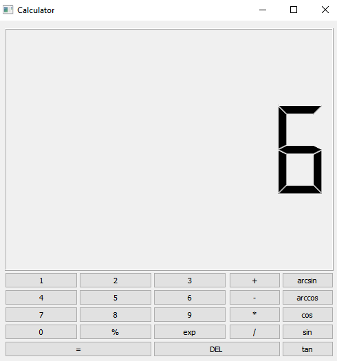

<br>

<br>


-----------------

## Traffic Light

In this exercise, we will use the QTimer to simulate a traffic light . we will write a  **Trafficlight** class. The traffic light has three lights: Red, yellow and green. The transitions will be from one light to another (red to yellow to green to yellow to red again) at certain intervals.And To make our test so special and funny we will add at the and another connexion between the keyboard and the three lights

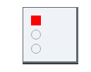
<p> To acheive our Goal we will need the following classes :

* **QTime:** provides functions for comparing times and for manipulating a time by adding a number of milliseconds
* **QTimerEvent:** contains parameters that describe a timer event. 
* **QKeyEvent :** describes a key event.(it will help us to make connection between the keyboad and lights) 
* **QWidget :** the base class of all user interface objects .
* **QRadioButton :**  an option button that can be switched on (checked) or off (unchecked) .
* **QVBoxLayout :** to lay out the three radiobuttons vertically </p>

--------------
## Trafficlight.h


<p>This is the declaration of our methodes and widgets..</p><br>

``` JavaScript
#include <QWidget>
#include<QTimerEvent>
#include<QKeyEvent>
#include<QTime>
#include<QRadioButton>
#include<QVBoxLayout>

class TrafficLight: public QWidget{
  Q_OBJECT

public:

  TrafficLight(QWidget * parent = nullptr);

protected:
     void createWidgets();
     void placeWidgets();
     void timerEvent(QTimerEvent *e) override; 
     //we added this function to make interaction between the keyboard and the lights
     void keyPressEvent(QKeyEvent *e) override;


private:
//create  lights 
  QRadioButton * redlight;
  QRadioButton * yellowlight;
  QRadioButton * greenlight;
  int currentTime;

};
```

--------------
## Trafficlight.cpp
--------------
``` JavaScript
#include "trafficlight.h"
TrafficLight::TrafficLight(QWidget * parent): QWidget(parent){

    //to create widgets
    createWidgets();

    //to place Widgets
    placeWidgets();

}

void TrafficLight::createWidgets()
{
  redlight = new QRadioButton;
  redlight->setEnabled(false); // check if  the light is enabling or not
  redlight->toggle(); //active the light 
  redlight->setStyleSheet("QRadioButton::indicator:checked { background-color: red;}");  //create a red background of the redlight

  yellowlight = new QRadioButton;
  yellowlight->setEnabled(false);
  yellowlight->setStyleSheet("QRadioButton::indicator:checked { background-color: yellow;}");

  greenlight = new QRadioButton;
  greenlight->setEnabled(false);
  greenlight->setStyleSheet("QRadioButton::indicator:checked { background-color: green;}");
 startTimer(2000);//start our timer with 2000ms
 currentTime=0;//initiate the currenttime by 0

}
void TrafficLight::placeWidgets()
{

  auto layout = new QVBoxLayout;//create a vertical layout 
  //add the widgets to our layout 
  layout->addWidget(redlight);
  layout->addWidget(yellowlight);
  layout->addWidget(greenlight);
  //make the layout visible 
  setLayout(layout);
}

void TrafficLight::timerEvent(QTimerEvent *e){
    currentTime++;
    //if the red-light is checked and pass his 3 seconds ->active the greenlight + initiate the currenttime 0
    if(redlight->isChecked() && currentTime== 3){
        greenlight->toggle();
        currentTime=0;
    }
    //the same thing for the others buttons
    if(greenlight->isChecked() && currentTime== 3){
        yellowlight->toggle();
        currentTime=0;
    }
    if(yellowlight->isChecked() && currentTime== 3){
        redlight->toggle();
        currentTime=0;
    }}
    //add the interaction between the keyboard and the lights :
void TrafficLight::keyPressEvent(QKeyEvent *e){
//press the key_escape ->exit     
    if(e->key() == Qt::Key_Escape)
     qApp->exit();
     //press the “R” -> active the redlight
    if(e->key() == Qt::Key_R){
     redlight->toggle();}
     //press the “G”-> active the greenlight
    if(e->key() == Qt::Key_G){
    greenlight->toggle();}
     //press the “Y” -> active the yellowlight
    if(e->key() == Qt::Key_Y){
     yellowlight->toggle();}
}

```
-------
## Main.cpp

```JavaScript
#include <QApplication>
#include "trafficlight.h"

int main(int argc, char *argv[])
{
    QApplication a(argc, argv);
    auto light = new TrafficLight;
    //showing the trafic light
    light->show();

    return a.exec();
}
```
------
## The Output

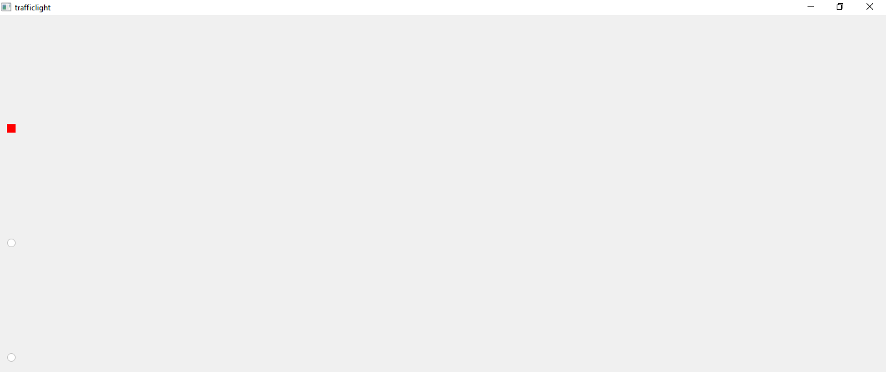
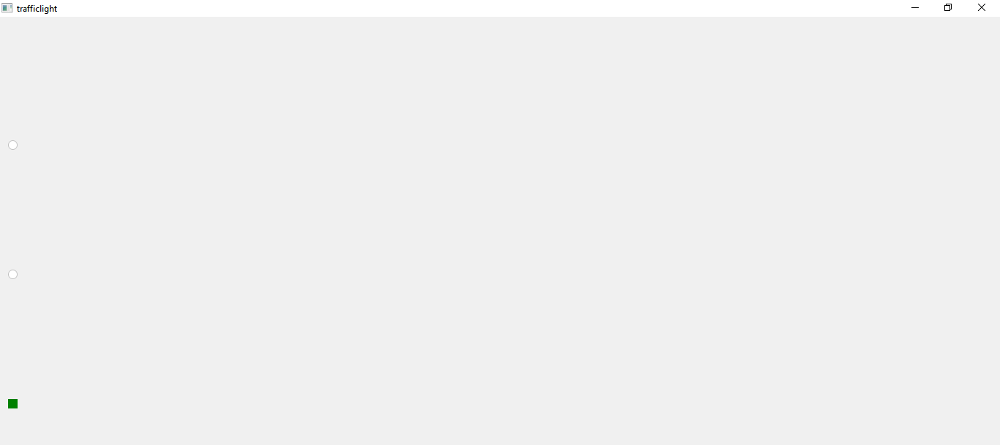
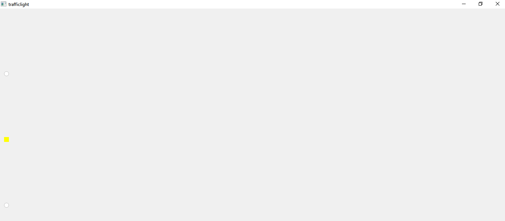


--------
## Digital Clock

<p>The Digital Clock  shows how to use QLCDNumber to display a number with LCD-like digits.

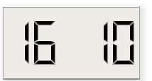

SO in this test we will create digitalemontre class that provides a clock widget showing the time with hours, minutes and seconds  using LCD numbers .

* We will implement a main function called **updateTime()** to update the clock display.
* we will need also the following class:

    * **QHBoxlayout:** to lay out the widgets 
     * **QWidget**
     * **QTime**
     * **TimerEvent**
     * **QLabel**
     * **QLCDnumber** to lay out widgets horizontally.</p>
<br>


-----------------------
## Digitalemontre.h


```JavaScript
#include <QWidget>
#include<QTimerEvent>
#include<QLabel>
#include<QTime>
#include<QLCDNumber>
#include<QHBoxLayout>
class digitalmontre : public QWidget
{
    Q_OBJECT
public:
    explicit digitalmontre(QWidget *parent = nullptr);

protected:
     void timerEvent(QTimerEvent *e)override;
void createwidgets();
void placewidgets();
void updateTime();
private:
QLabel *time;
//create the lcd number watch components
QLCDNumber *hour;
QLCDNumber *minute;
QLCDNumber *seconde;

};

```
-----------
## Digitalemontre.cpp


<p>The implementation of methods:</p>

```JavaScript
#include "digitalemontre.h"
#include "ui_digitalemontre.h"


digitalmontre::digitalmontre(QWidget *parent) : QWidget(parent)
{
    //Creatign the widgets
    createwidgets();
    //place Widgets
    placewidgets();
     //starting the timer with 1000ms
    startTimer(1000);
}
    //updating the time according to the current time clock
void digitalmontre::updateTime(){
    auto t= QTime::currentTime();
    //display the current time hour clock format
    hour->display(t.hour());
    //display the current time minute clock format
    minute->display(t.minute());
    //display the current time second clock format
    seconde->display(t.second());
}
void digitalmontre::timerEvent(QTimerEvent *e){

   updateTime();
}
void digitalmontre::createwidgets(){
hour= new QLCDNumber;
minute= new QLCDNumber;
seconde= new QLCDNumber;
auto t= QTime::currentTime();
hour->display(t.hour());
minute->display(t.minute());
seconde->display(t.second());
//set the size of the LCD number(hour,minute,second)
hour->setMinimumHeight(80);
minute->setMinimumHeight(80);
seconde->setMinimumHeight(80);
}
void digitalmontre::placewidgets(){
 //create a horizontal layout
QLayout *layout= new QHBoxLayout;
layout->addWidget(hour);
layout->addWidget(minute);
layout->addWidget(seconde);

 //make the layout visible
setLayout(layout);
}

```
--------------
## Main.cpp

```JavaScript
#include <QApplication>
#include"digitalemontre.h"
int main(int argc, char *argv[])
{
    QApplication app(argc, argv);
auto p= new digitalmontre;
p->show();
    return app.exec();
}
```
--------
## The Output


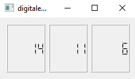
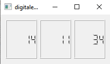
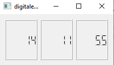

-------
## Conclusion

Finally, in summary, Qt's signal/slot is to solve the communication problem between objects, while avoiding memory field pointers and object life cycle problems caused by shared pointers.
<br>
 I hope this will give you an idea of just how powerful and flexible the QT Signal/slot mechanism is .

